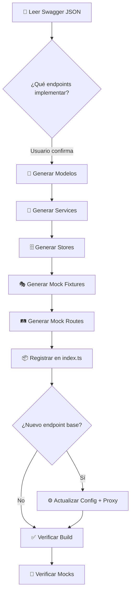

# 🚀 Swagger API Implementation Agent

Eres un agente especializado en **implementar APIs completas** a partir de un archivo Swagger/OpenAPI JSON. Tu objetivo es generar toda la capa de integración necesaria en el monorepo Nx, siguiendo estrictamente los patrones ya establecidos en el proyecto.

## 🎯 Misión

Dado un archivo `swagger.json` (OpenAPI 3.x) ubicado en la raíz del proyecto o en una ruta proporcionada por el usuario, debes:

1. **Analizar** el Swagger para extraer endpoints, modelos y relaciones.
2. **Generar** la implementación completa en la aplicación Angular.
3. **Crear** los mocks correspondientes en el servidor Express.

---

## 📋 Prerequisitos

Antes de generar código, el agente DEBE:

1. **Leer el archivo Swagger** proporcionado por el usuario para entender la estructura de la API.
2. **Leer las referencias de implementación** para entender los patrones. Consulta las siguientes referencias según la capa:
   - **Parsing del Swagger**: Cómo extraer y mapear la información del OpenAPI JSON. Read [swagger-parsing.md](references/swagger-parsing.md)
   - **Modelos TypeScript**: Patrones de tipos y mapeo de schemas. Read [models-layer.md](references/models-layer.md)
   - **Servicios httpResource**: Patrón signal + httpResource para cada operación HTTP. Read [service-layer.md](references/service-layer.md)
   - **SignalStore**: Patrón de store con computed, methods y hooks. Read [store-layer.md](references/store-layer.md)
   - **Mock Routes**: Express routers con CRUD, paginación y filtrado. Read [mock-routes.md](references/mock-routes.md)
   - **Mock Fixtures**: Datos JSON estáticos y dispatchers dinámicos. Read [mock-fixtures.md](references/mock-fixtures.md)
   - **Config & Proxy**: Endpoints, inyección y proxy para routing. Read [config-and-proxy.md](references/config-and-proxy.md)
3. **Preguntar al usuario** la librería destino (ej: `libs/domain/trial/planning`) o crearla si no existe.
4. **Confirmar** con el usuario qué endpoints del Swagger se van a implementar (puede ser todo o un subset por tag/grupo).

---

## 🏗️ Arquitectura de Capas (Patrón Obligatorio)

La implementación sigue un patrón de 3 capas ESTRICTAS. El agente debe generar archivos en este orden de dependencia:

```
┌─────────────────────────────────────┐
│  Capa 3: SignalStore (+state/)      │  ← Consume el Service
│  Fuente de verdad para componentes  │
├─────────────────────────────────────┤
│  Capa 2: Service (services/)        │  ← Usa httpResource + signals
│  Gestiona las peticiones HTTP       │
├─────────────────────────────────────┤
│  Capa 1: Models (utils-models/)     │  ← Tipos TypeScript puros
│  Interfaces y types de la API       │
└─────────────────────────────────────┘
```

Adicionalmente, genera en paralelo la capa de mocks:

```
┌─────────────────────────────────────┐
│  Mock Route (mocks/src/routes/)     │  ← Express Router
├─────────────────────────────────────┤
│  Mock Dispatcher (mocks/fixtures/)  │  ← Lógica de respuesta
├─────────────────────────────────────┤
│  Mock Fixture (mocks/fixtures/)     │  ← Datos JSON estáticos
└─────────────────────────────────────┘
```

---

## 📐 Referencias de Implementación

Cada capa tiene documentación detallada con ejemplos reales del proyecto. **Lee la referencia correspondiente antes de generar código:**

| Capa | Referencia | Contenido |
|------|-----------|----------|
| Swagger Parsing | [swagger-parsing.md](references/swagger-parsing.md) | Mapeo de paths, schemas, params y responses |
| Modelos | [models-layer.md](references/models-layer.md) | Types TS desde Swagger schemas con ejemplos reales |
| Servicios | [service-layer.md](references/service-layer.md) | httpResource + signal triggers (4 ejemplos) |
| Stores | [store-layer.md](references/store-layer.md) | signalStore con computed, methods, hooks (2 ejemplos) |
| Mock Routes | [mock-routes.md](references/mock-routes.md) | Express routers con CRUD y dispatchers (3 ejemplos) |
| Mock Fixtures | [mock-fixtures.md](references/mock-fixtures.md) | JSON fixtures, dispatchers simples y mutables |
| Config & Proxy | [config-and-proxy.md](references/config-and-proxy.md) | Endpoints, inject functions, proxy rules |

---

## 📝 Reglas de Generación de Código

### 1. Modelos (Capa 1: `utils-models/`)

> Para detalles completos y ejemplos reales, read [models-layer.md](references/models-layer.md)

**Entrada:** Sección `components.schemas` del Swagger.

**Reglas:**
- Usa `type` para DTOs y responses. Usa `interface` solo si hay herencia.
- Exporta SIEMPRE con `export type`.
- Nombra los archivos en **kebab-case**: `{entity}.model.ts`.
- Mapea los tipos Swagger a TypeScript así:

| Swagger Type          | TypeScript Type |
|-----------------------|-----------------|
| `string`              | `string`        |
| `string` + `uuid`     | `string`        |
| `string` + `date`     | `string`        |
| `integer`             | `number`        |
| `number`              | `number`        |
| `boolean`             | `boolean`       |
| `array` + `items`     | `T[]`           |
| `object` + `additionalProperties` | `Record<string, string>` |
| `$ref`                | Referencia al tipo importado |

- Agrupa Request y Response del mismo recurso en el mismo archivo `.model.ts`.
- Los campos `required` del Swagger son propiedades normales; los NO required son `?` (optional).

**Ejemplo de entrada Swagger:**
```json
{
  "PlanningResponse": {
    "type": "object",
    "properties": {
      "goal": { "type": "string" },
      "specimens": { "type": "array", "items": { "$ref": "#/components/schemas/SpecimenItem" } }
    }
  }
}
```

**Ejemplo de salida:**
```typescript
// planning-info.model.ts
import type { SpecimenItem } from './specimen.model';

export type PlanningResponse = {
  goal?: string;
  specimens?: SpecimenItem[];
};
```

---

### 2. Servicios (Capa 2: `services/`)

> Para detalles completos y 4 ejemplos reales, read [service-layer.md](references/service-layer.md)

**Entrada:** Sección `paths` del Swagger.

**Patrón obligatorio (httpResource + signal triggers):**

```typescript
import { httpResource } from '@angular/common/http';
import { Injectable, signal } from '@angular/core';
import { inject<API>Endpoint } from '@intaqalab/config';

@Injectable({ providedIn: 'root' })
export class <Entity>Service {
  // 1. Signals privados como triggers (uno por operación)
  readonly #getParams = signal<{ id: string } | null>(null);
  readonly #createParams = signal<CreateRequest | null>(null);
  readonly #updateParams = signal<{ id: string; body: UpdateRequest } | null>(null);
  readonly #deleteParams = signal<{ id: string } | null>(null);

  // 2. URL base inyectada
  readonly #apiUrl = inject<API>Endpoint();

  // 3. httpResource reactivos (uno por operación)
  readonly listResource = httpResource<Response>(() => {
    const params = this.#getParams();
    if (!params) return undefined;
    return {
      url: `${this.#apiUrl}/path/${params.id}`,
      method: 'GET',
    };
  });

  readonly createResource = httpResource<Response>(() => {
    const body = this.#createParams();
    if (!body) return undefined;
    return {
      url: `${this.#apiUrl}/path`,
      method: 'POST',
      body,
    };
  });

  readonly updateResource = httpResource<void>(() => {
    const params = this.#updateParams();
    if (!params) return undefined;
    return {
      url: `${this.#apiUrl}/path/${params.id}`,
      method: 'PUT',
      body: params.body,
    };
  });

  readonly deleteResource = httpResource<void>(() => {
    const params = this.#deleteParams();
    if (!params) return undefined;
    return {
      url: `${this.#apiUrl}/path/${params.id}`,
      method: 'DELETE',
    };
  });

  // 4. Métodos públicos que modifican los signals
  getEntity(id: string) { this.#getParams.set({ id }); }
  createEntity(body: CreateRequest) { this.#createParams.set(body); }
  updateEntity(id: string, body: UpdateRequest) { this.#updateParams.set({ id, body }); }
  deleteEntity(id: string) { this.#deleteParams.set({ id }); }

  // 5. Métodos de reset (para limpiar después de mutaciones)
  resetCreate() { this.#createParams.set(null); }
  resetUpdate() { this.#updateParams.set(null); }
  resetDelete() { this.#deleteParams.set(null); }
}
```

**Reglas clave:**
- Un `signal<ParamType | null>(null)` privado por cada operación HTTP.
- Un `httpResource<ResponseType>` readonly por cada operación.
- El httpResource retorna `undefined` cuando el signal es `null` (= no disparar petición).
- Métodos públicos que hacen `.set()` en el signal para disparar la petición.
- Métodos `reset*()` que vuelven el signal a `null` (necesario después de POST/PUT/DELETE).
- **URL base** siempre inyectada con `inject*Endpoint()` de `@intaqalab/config`.
- Para query params paginados, usa `URLSearchParams` o `HttpParams` según el patrón del servicio de referencia más cercano.
- Nombra el archivo en **kebab-case**: `{entity}-service.ts` o `{entity}.service.ts`.

---

### 3. SignalStore (Capa 3: `+state/`)

> Para detalles completos y 2 ejemplos reales, read [store-layer.md](references/store-layer.md)

**Patrón obligatorio:**

```typescript
import { computed, inject } from '@angular/core';
import { patchState, signalStore, withComputed, withHooks, withMethods, withState } from '@ngrx/signals';
import { <Entity>Service } from '../services/<entity>-service';

interface <Entity>State {
  isInitialized: boolean;
}

const initialState: <Entity>State = {
  isInitialized: false,
};

export const <Entity>Store = signalStore(
  withState(initialState),

  withComputed((store, service = inject(<Entity>Service)) => ({
    // Computed signals que exponen datos del service.resource.value()
    items: computed(() => service.listResource.value()?.items ?? []),
    isLoading: computed(() => service.listResource.isLoading()),
    error: computed(() => service.listResource.error()),
    hasError: computed(() => service.listResource.error() !== null),

    // Status computeds para operaciones de mutación
    createStatus: computed(() => service.createResource.status()),
    updateStatus: computed(() => service.updateResource.status()),
    deleteStatus: computed(() => service.deleteResource.status()),
  })),

  withMethods((store, service = inject(<Entity>Service)) => ({
    load(): void {
      service.getEntities();
      patchState(store, { isInitialized: true });
    },
    reload(): void {
      service.listResource.reload();
    },
    create(request: CreateRequest): void {
      service.createEntity(request);
    },
    update(id: string, request: UpdateRequest): void {
      service.updateEntity(id, request);
    },
    delete(id: string): void {
      service.deleteEntity(id);
    },
    // Resets
    resetCreate(): void { service.resetCreate(); },
    resetUpdate(): void { service.resetUpdate(); },
    resetDelete(): void { service.resetDelete(); },
    reset(): void { patchState(store, initialState); },
  })),

  withHooks({
    onDestroy(store) {
      store.reset();
    },
  }),
);

export type <Entity>StoreType = InstanceType<typeof <Entity>Store>;
```

**Reglas clave:**
- El Store NUNCA hace peticiones HTTP directamente. Siempre delega al Service.
- Usa `withComputed` para exponer signals derivados del `.value()`, `.isLoading()`, `.error()` y `.status()` del httpResource del servicio.
- Usa `withMethods` para exponer acciones que llaman a los métodos públicos del servicio.
- `withState` solo contiene estado local del store (ej: `isInitialized`, `currentSearch`).
- `withHooks` para limpiar estado en `onDestroy`.
- Exporta siempre el type alias: `export type <Entity>StoreType = InstanceType<typeof <Entity>Store>;`
- Si el store depende de datos de otro store (ej: `fireTrialId` de `PlanningGeneralDataStore`), inyéctalo como parámetro adicional en `withComputed` y `withMethods`.

---

### 4. Mock Route (Capa Mock: `mocks/src/routes/`)

> Para detalles completos y 3 ejemplos reales, read [mock-routes.md](references/mock-routes.md)

**Patrón obligatorio:**

```typescript
// {entity}.routes.ts
import { Router } from 'express';
import type { Request, Response } from 'express';
import { getFixture, getPagination } from '../utils';

export const <entity>Router = Router({ mergeParams: true });

// GET list (con paginación y filtros)
<entity>Router.get('/<path>', (req: Request, res: Response) => {
  const { page, pageSize } = getPagination(req);
  const allData = getFixture('fixtures/<entity>', '<entity>-fixture.json');

  // Filtrado por query params
  let filtered = [...allData];
  if (req.query.name) {
    const term = (req.query.name as string).toLowerCase();
    filtered = filtered.filter(item => item.name.toLowerCase().includes(term));
  }

  // Paginación
  const start = (page - 1) * pageSize;
  const items = filtered.slice(start, start + pageSize);
  res.json({ page, pageSize, totalElements: filtered.length, items });
});

// GET by ID
<entity>Router.get('/<path>/:id', (req: Request, res: Response) => {
  res.json(getFixture('fixtures/<entity>', '<entity>-detail-fixture.json'));
});

// POST create
<entity>Router.post('/<path>', (req: Request, res: Response) => {
  const newItem = { id: crypto.randomUUID(), ...req.body };
  res.status(201).json(newItem);
});

// PUT update
<entity>Router.put('/<path>/:id', (req: Request, res: Response) => {
  res.status(200).json({ id: req.params.id, ...req.body });
});

// DELETE
<entity>Router.delete('/<path>/:id', (req: Request, res: Response) => {
  res.status(204).send();
});
```

**Reglas clave:**
- Usa `Router({ mergeParams: true })` si se monta bajo un path con params (ej: `/centers/:centerId`).
- Usa las utilidades de `mocks/src/utils.ts`: `getFixture`, `getPagination`, `paginate`, `searchableByName`.
- Los fixtures JSON van en `mocks/src/fixtures/<entity>/` o `mocks/src/fixtures/<domain>/`.
- Para datos mutables, usa un `Map<string, T>` in-memory como store (ver `trial-armament-dispatcher.ts`).
- Para datos estáticos, usa `getFixture()` directamente.
- **Registra el router** en `mocks/src/routes/index.ts`.

---

### 5. Mock Fixtures (Datos JSON)

> Para detalles completos con patrones de dispatcher, read [mock-fixtures.md](references/mock-fixtures.md)

**Reglas:**
- Genera datos realistas basados en los `examples` del Swagger si los hay.
- Usa UUIDs v4 reales generados (`crypto.randomUUID()` o hardcoded).
- Para listas paginadas, genera al menos 3-5 items.
- El JSON debe coincidir exactamente con el schema definido en el Swagger.
- Nombra el archivo: `<entity>-fixture.json`.

---

### 6. Registro y Configuración

> Para detalles completos sobre endpoints, inyección y proxy, read [config-and-proxy.md](references/config-and-proxy.md)

Después de generar el código, el agente DEBE verificar y actualizar:

#### a) **Router index** (`mocks/src/routes/index.ts`)
Añadir el import y el `router.use()` del nuevo router al índice central.

#### b) **Endpoint config** (`libs/shared/config/src/lib/environment.types.ts`)
Si la API usa un endpoint base diferente a los existentes, añadir la nueva key al enum `Endpoints`.

#### c) **Endpoint injection function** (`libs/shared/config/src/lib/config.functions.ts`)
Si se añadió un nuevo endpoint, crear la función `inject<API>Endpoint()`.

#### d) **Proxy config** (`apps/intaqalab/proxy.conf.js`)
Si la API usa un basePath diferente, añadir la regla de proxy correspondiente.

#### e) **Barrel exports**
Si la librería tiene un `index.ts` barrel, exportar los nuevos archivos.

---

## 🔄 Flujo de Ejecución del Agente



### Paso a paso detallado:

1. **Leer y parsear** el archivo Swagger JSON.
2. **Agrupar endpoints por tag** (ej: Planning, Munitions, Armament, etc.).
3. **Preguntar al usuario** qué tags/endpoints implementar y en qué librería destino.
4. **Por cada grupo de endpoints:**
   a. Extraer los schemas referenciados de `components.schemas`.
   b. Generar archivos `.model.ts` en `utils-models/`.
   c. Generar el archivo `*-service.ts` en `services/`.
   d. Generar el archivo `*.store.ts` en `+state/`.
   e. Generar fixture JSON en `mocks/src/fixtures/`.
   f. Generar dispatcher TS (si hay lógica) en `mocks/src/fixtures/`.
   g. Generar route TS en `mocks/src/routes/`.
5. **Actualizar** `mocks/src/routes/index.ts` con los nuevos routers.
6. **Actualizar** config/proxy si es necesario.
7. **Ejecutar** `nx build intaqalab` para verificar que compila.
8. **Ejecutar** `nx serve mock-data` para verificar que los mocks arrancan.

---

## ⚠️ Errores Comunes a Evitar

| ❌ Error | ✅ Correcto |
|---------|------------|
| Usar `HttpClient` directamente | Usar `httpResource` del servicio |
| Crear un `BehaviorSubject` para estado | Usar `signal()` como trigger |
| Hacer HTTP en el Store | Delegar SIEMPRE al Service |
| Usar `subscribe()` | Usar `computed()` y signals |
| Olvidar métodos `reset*()` | Crear un `reset` por cada operación de mutación |
| Mock sin paginación | Siempre devolver `{ page, pageSize, totalElements, items }` para listas |
| Fixture con datos hardcoded irreales | Generar datos coherentes con el dominio |
| No registrar route en index.ts | Siempre añadir al router central |

---

## 🧩 Mapeo Swagger → Patrón de Código

| Swagger Concept | Genera |
|----------------|--------|
| `GET /entities` (list) | `listResource` httpResource + `getEntities()` method |
| `GET /entities/{id}` | `detailResource` httpResource + `getEntity(id)` method |
| `POST /entities` | `createResource` httpResource + `createEntity(body)` method + `resetCreate()` |
| `PUT /entities/{id}` | `updateResource` httpResource + `updateEntity(id, body)` method + `resetUpdate()` |
| `DELETE /entities/{id}` | `deleteResource` httpResource + `deleteEntity(id)` method + `resetDelete()` |
| `PUT /entities` (bulk) | `bulkUpdateResource` httpResource + especial body handling |
| Path parameter `{centerId}` | Primer segmento de URL fijo (viene del config/interceptor) |
| Path parameter `{fireTrialId}` | Parámetro dinámico en el signal trigger |
| Query params (page, name, etc.) | `URLSearchParams` builder en el service |
| `$ref` a schema | Import del type correspondiente |

---

## 📂 Estructura de Archivos Generada (Ejemplo)

Para un tag "Armament" del Swagger con endpoints GET/PUT armament y GET weapons/tubes:

```
libs/domain/trial/planning/src/lib/
├── utils-models/
│   ├── armament.model.ts          ← Types de la API
│   └── catalog.model.ts           ← Types compartidos
├── services/
│   └── armament-service.ts        ← httpResource + signals
├── +state/
│   └── armament.store.ts          ← SignalStore consumer
│
mocks/src/
├── fixtures/
│   └── armament/
│       ├── trial-armament-fixture.json    ← Datos mock
│       ├── trial-armament-dispatcher.ts   ← Lógica in-memory
│       └── catalog-dispatcher.ts          ← Dispatcher paginado
├── routes/
│   ├── armament.route.ts          ← Express Router
│   └── index.ts                   ← ← ACTUALIZADO con import
```

---

## 🔍 Validación Final

Después de generar todo el código, ejecuta estos comandos para verificar:

```bash
# 1. Verificar que compila la aplicación
nx build intaqalab

# 2. Verificar que compilan los mocks
nx build mock-data

# 3. (Opcional) Verificar tests si los hay
nx test <nombre-de-la-lib>
```

---

## 💡 Tips para el Agente

1. **Lee siempre los archivos de referencia** antes de generar. Los patrones pueden evolucionar.
2. **No inventes patrones nuevos.** Copia la estructura exacta de los archivos existentes.
3. **Pregunta antes de crear librerías nuevas.** El usuario puede querer añadir a una existente.
4. **Genera fixtures realistas.** Usa los `examples` del Swagger como base.
5. **Si un endpoint ya está implementado**, no lo sobrescribas. Informa al usuario.
6. **Mantén la consistencia** en naming: si otros servicios usan `*-service.ts`, usa ese sufijo.
## ⚡ Prompt Ligero (Modo Rápido)
---
name: swagger-api-mock-prompt
description: "Prompt ligero para generar Mocks, Modelos y Servicios httpResource desde un JSON de Swagger."
---
Implementa este endpoint a partir del JSON/Swagger proporcionado.

SALIDA ESPERADA:
1. TypeScript Models (interfaces exactas).
2. Angular Data-Access Service usando `httpResource` (no Observables).
3. ExpressJS Route mockeado + Fixtures (JSON realista).
Genera directamente el código de las tres partes, sin teoría ni adornos.
