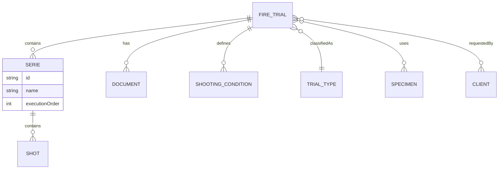
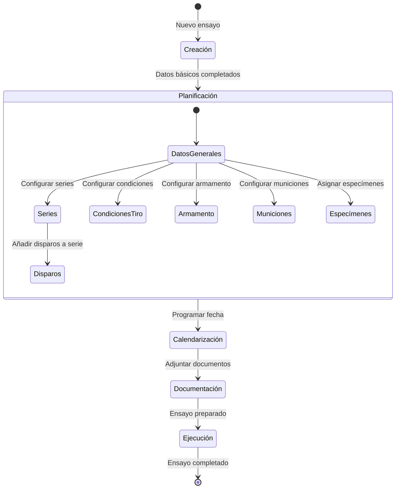

# 📖 Dominio y Glosario (Ubiquitous Language)

Para garantizar un código mantenible y evitar divergencias en la nomenclatura, todo el equipo (y la IA) debe utilizar **estrictamente** los siguientes términos para nombrar variables, clases, componentes y APIs en INTAQALAB.

## 1. Glosario de Entidades (Inglés/Español)

| Término (Código)       | Concepto Negocio (ES) | Definición                                                                   |
| ---------------------- | --------------------- | ---------------------------------------------------------------------------- |
| **Fire Trial**         | Ensayo de fuego       | La entidad principal del sistema (Trial).                                    |
| **Serie**              | Serie                 | Agrupación ordenada de disparos dentro de un ensayo.                         |
| **Shot**               | Disparo               | Disparo individual dentro de una serie.                                      |
| **Specimen**           | Espécimen / Probeta   | Objeto o probeta utilizada como objetivo/blanco en un ensayo.                |
| **Armament**           | Armamento             | Arma o cañón utilizado para ejecutar los disparos.                           |
| **Munition**           | Munición              | Munición configurada con parámetros específicos (calibre, temperatura, etc). |
| **Shooting Condition** | Condición de tiro     | Tipo de blanco, material, dimensiones, espesor y zona de impacto.            |
| **Master Data**        | Datos Maestros        | Catálogos de referencia (Tipos de ensayo, tipos de blanco, dimensiones...).  |

## 2. Modelo de Relaciones (Entity Diagram)

El ciclo vital de la planificación de un ensayo relaciona estas entidades del siguiente modo:

## 3. Flujo de un Ensayo de Fuego

