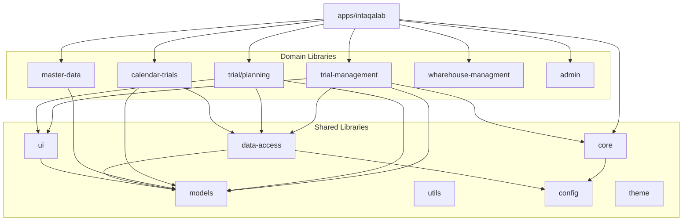
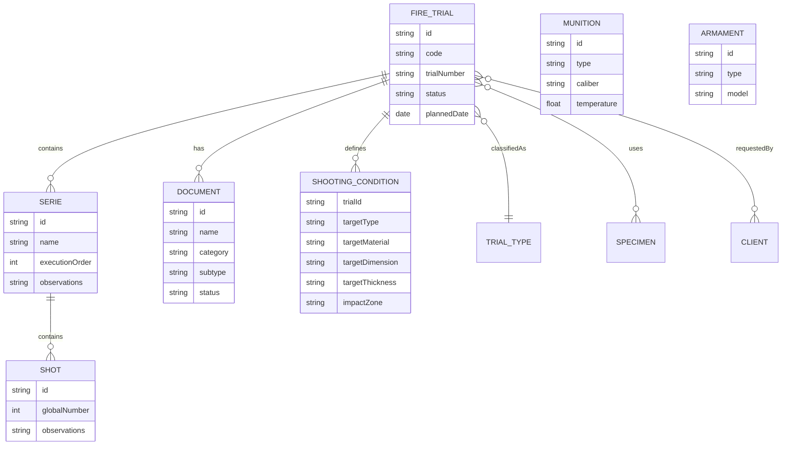
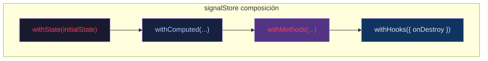
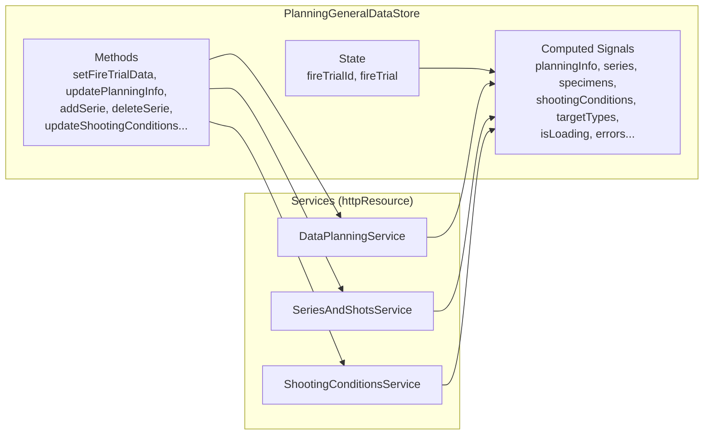
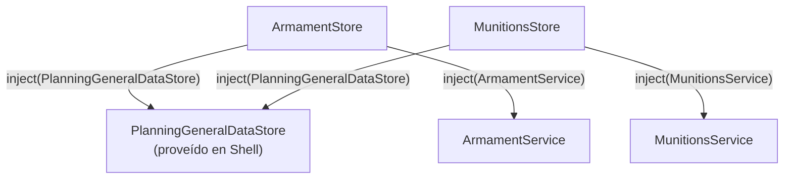
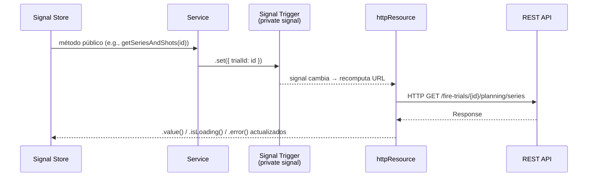
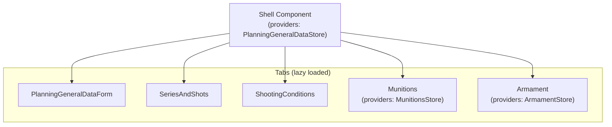
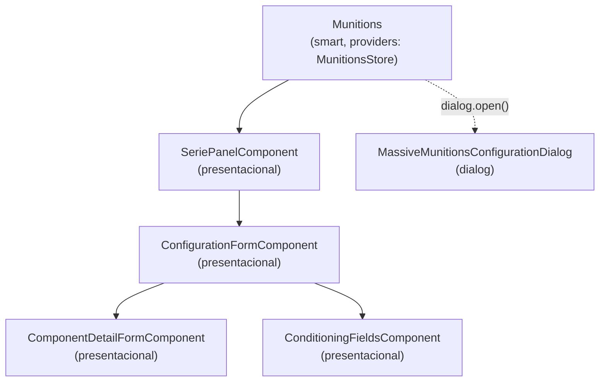
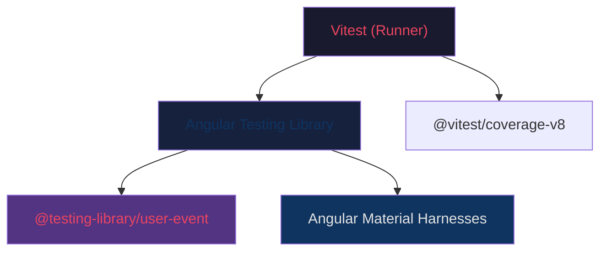
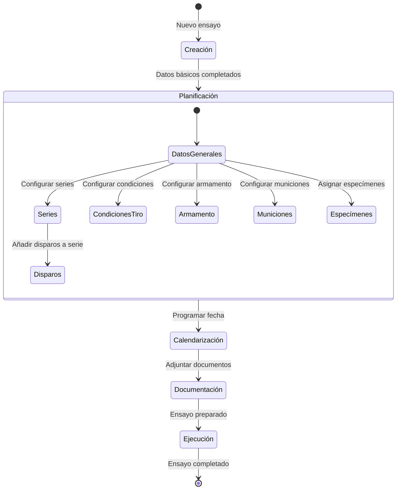

# 📋 Documento Técnico de Diseño (TDD) — INTAQALAB

> **Proyecto:** INTAQALAB  
> **Organización:** INTA (Instituto Nacional de Técnica Aeroespacial)  
> **Versión del documento:** 1.0  
> **Fecha:** 11 de febrero de 2026  
> **Repositorio:** `scm/~caiglesias/nx-intaqalab`

---

## 1. Resumen Ejecutivo

**INTAQALAB** es una aplicación web empresarial desarrollada para el **INTA** (Instituto Nacional de Técnica Aeroespacial), orientada a la **gestión integral de ensayos de fuego** (_fire trials_). El sistema cubre el ciclo de vida completo de los ensayos: desde la planificación y configuración de armamento y municiones, hasta la gestión documental, la calendarización y la administración de datos maestros.

La aplicación está construida como un **monorepo Nx** con **Angular 21** como framework principal, adoptando una arquitectura moderna basada en **Signals**, **Zoneless Change Detection** y **Signal Forms**, representando el estado del arte en desarrollo Angular.

---

## 2. Objetivos del Sistema

| Objetivo                       | Descripción                                                                                                                |
| ------------------------------ | -------------------------------------------------------------------------------------------------------------------------- |
| 🎯 **Gestión de Ensayos**      | Crear, modificar, visualizar y listar ensayos de fuego con sus datos asociados                                             |
| 📅 **Calendarización**         | Programar y visualizar ensayos en un calendario interactivo                                                                |
| 🔫 **Planificación Balística** | Configurar armamento, municiones, series de disparo, condiciones de tiro y especímenes                                     |
| 📄 **Gestión Documental**      | Asociar, subir, descargar y categorizar documentos vinculados a ensayos                                                    |
| 🏗️ **Datos Maestros**          | Administrar catálogos de tipos de ensayo, tipos de blanco, materiales, dimensiones, tipos de espoleta y tipos de documento |
| 🏭 **Gestión de Almacén**      | Controlar el inventario y almacenamiento de materiales de ensayo                                                           |

---

## 3. Stack Tecnológico

### 3.1 Frontend

| Tecnología           | Versión | Propósito                                                              |
| -------------------- | ------- | ---------------------------------------------------------------------- |
| **Angular**          | 21.0.2  | Framework principal (Signal Architecture, Zoneless)                    |
| **Nx**               | 22.1.3  | Gestor de monorepo, build system, task runner                          |
| **TypeScript**       | 5.9.2   | Lenguaje (modo estricto)                                               |
| **Angular Material** | 21.0.6  | Biblioteca de componentes UI                                           |
| **Angular CDK**      | 21.0.6  | Utilidades de desarrollo de componentes                                |
| **TailwindCSS**      | 4.x     | Framework de utilidades CSS                                            |
| **SCSS**             | —       | Preprocesador CSS                                                      |
| **NgRx Signals**     | 20.x    | Gestión de estado reactiva basada en Signals                           |
| **RxJS**             | 7.8.x   | Programación reactiva (uso restringido a interceptores y pipes legacy) |
| **@ngx-translate**   | 17.x    | Internacionalización (i18n)                                            |
| **ngx-toastr**       | 19.x    | Notificaciones toast                                                   |
| **angular-calendar** | 0.32.x  | Componente de calendario                                               |
| **date-fns**         | 4.x     | Utilidades de manipulación de fechas                                   |

### 3.2 Testing

| Tecnología                      | Versión | Propósito                                         |
| ------------------------------- | ------- | ------------------------------------------------- |
| **Vitest**                      | 4.x     | Test runner principal                             |
| **@testing-library/angular**    | 18.x    | Renderizado de componentes centrado en el usuario |
| **@testing-library/user-event** | 14.x    | Simulación de interacciones de usuario            |
| **@testing-library/jest-dom**   | 6.x     | Matchers adicionales para el DOM                  |
| **@angular/cdk/testing**        | —       | Component Harnesses para Angular Material         |
| **jsdom**                       | 22.x    | Entorno de navegador simulado                     |

### 3.3 Backend (Mock Server)

| Tecnología      | Versión | Propósito                           |
| --------------- | ------- | ----------------------------------- |
| **Express**     | 4.x     | Servidor mock para desarrollo local |
| **json-server** | 0.17.4  | API REST basada en fixtures JSON    |

### 3.4 Calidad de Código

| Herramienta             | Propósito                             |
| ----------------------- | ------------------------------------- |
| **ESLint**              | Linting (reglas Angular + TypeScript) |
| **Prettier**            | Formateo de código                    |
| **@vitest/coverage-v8** | Cobertura de tests                    |

---

## 4. Arquitectura del Monorepo

### 4.1 Estructura de Alto Nivel

```
nx-intaqalab/
├── apps/
│   └── intaqalab/              # Aplicación Angular principal (shell)
├── libs/
│   ├── core/                   # Interceptores HTTP, loader, auth, utilidades globales
│   ├── demos/                  # Componentes de demostración y prototipado
│   ├── pruebas/                # Librería de pruebas experimentales
│   ├── domain/                 # Lógica de negocio por dominio
│   │   ├── admin/              # Módulo de administración
│   │   ├── calendar-trials/    # Calendarización de ensayos
│   │   ├── master-data/        # Gestión de datos maestros (CRUD)
│   │   ├── trial/
│   │   │   ├── planning/       # Planificación de ensayos (armamento, municiones, series)
│   │   │   └── trial-management/ # CRUD de ensayos, documentación
│   │   └── wharehouse-managment/ # Gestión de almacén
│   └── shared/                 # Código compartido transversal
│       ├── config/             # Configuración de entorno y tokens
│       ├── data-access/        # Servicios HTTP compartidos
│       ├── models/             # Interfaces y modelos de dominio
│       ├── theme/              # Tema visual compartido
│       ├── ui/                 # Componentes UI reutilizables
│       └── utils/              # Utilidades, pipes y helpers de testing
├── mocks/                      # Servidor Express mock con fixtures JSON
└── scripts/                    # Scripts de utilidad (merge de cobertura)
```

### 4.2 Diagrama de Dependencias



### 4.3 Reglas de Boundaries (Module Boundaries)

| Capa                                 | Puede importar de                      | No puede importar de           |
| ------------------------------------ | -------------------------------------- | ------------------------------ |
| `feature` (componentes inteligentes) | `data-access`, `ui`, `models`, `utils` | Otras features directamente    |
| `ui` (componentes presentacionales)  | `models`, `utils`                      | `data-access`, `feature`       |
| `data-access` (servicios, stores)    | `models`, `utils`, `config`            | `feature`, `ui`                |
| `util`                               | `models`                               | `feature`, `ui`, `data-access` |

---

## 5. Arquitectura de la Aplicación

### 5.1 Configuración Global (`app.config.ts`)

La aplicación se configura de forma **standalone** sin módulos, utilizando providers funcionales:

- **Routing:** `provideRouter()` con `withComponentInputBinding()` para binding de parámetros de ruta a inputs de señal.
- **HTTP:** `provideHttpClient()` con pipeline de interceptores funcionales:
  - `loaderInterceptor` — Muestra/oculta indicador de carga global.
  - `centerInterceptor` — Inyecta cabecera de centro INTA.
  - `authInterceptor` — Autenticación de peticiones.
  - `languageInterceptor` — Cabecera `Accept-Language`.
  - `globalHttpErrorInterceptor` — Manejo centralizado de errores HTTP.
  - `successToastInterceptor` — Notificaciones de éxito automáticas.
- **i18n:** `provideTranslateService()` con carga de archivos JSON por idioma (`/i18n/{lang}.json`).
- **Locale:** `es-ES` como locale por defecto.
- **Zoneless:** Detección de cambios con `provideZoneChangeDetection({ eventCoalescing: true })`.

### 5.2 Rutas Principales

| Ruta                    | Módulo                            | Descripción                           |
| ----------------------- | --------------------------------- | ------------------------------------- |
| `/planning/:id`         | `@intaqalab/planning`             | Planificación de un ensayo específico |
| `/trial2/new`           | `@intaqalab/trial-management`     | Creación de nuevo ensayo              |
| `/trial2/list`          | `@intaqalab/trial-management`     | Listado de ensayos                    |
| `/trial2/view/:id`      | `@intaqalab/trial-management`     | Visualización de un ensayo            |
| `/trial2/document/:id`  | `@intaqalab/trial-management`     | Documentación de un ensayo            |
| `/calendar-trials`      | `@intaqalab/calendar-trials`      | Calendario de ensayos                 |
| `/master-data/*`        | `@intaqalab/master-data`          | Catálogos maestros (CRUD genérico)    |
| `/wharehouse-managment` | `@intaqalab/wharehouse-managment` | Gestión de almacén                    |
| `/demos`                | `@intaqalab/demos`                | Componentes de demo                   |

Todas las rutas utilizan **lazy loading** a través de `loadChildren()` con `resolveLazyModule()`.

---

## 6. Modelo de Dominio

### 6.1 Entidades Principales



### 6.2 Datos Maestros

El módulo de datos maestros implementa un **patrón shell genérico** reutilizable (`MasterDataShellComponent`) que se parametriza por ruta:

| Catálogo           | Ruta                         | Servicio              |
| ------------------ | ---------------------------- | --------------------- |
| Tipos de ensayo    | `/master-data/trial-type`    | `TrialTypeService`    |
| Tipos de documento | `/master-data/document-type` | `DocumentTypeService` |
| Tipos de blanco    | `/master-data/target-type`   | `TargetTypeService`   |
| Materiales         | `/master-data/material`      | `MaterialService`     |
| Dimensiones        | `/master-data/dimension`     | `DimensionService`    |
| Tipos de espoleta  | `/master-data/fuze-type`     | `FuzeTypeService`     |

Cada servicio concreto extiende `MasterDataService` y se inyecta mediante `useExisting` a nivel de ruta.

---

## 7. Gestión de Estado

### 7.1 Patrón: NgRx Signal Store

El estado de la aplicación se gestiona mediante **NgRx Signal Stores**, que proporcionan un modelo reactivo basado en Signals nativo de Angular 21. Cada store se construye composicionalmente usando operadores funcionales:



| Operador                   | Función                                                                                                              |
| -------------------------- | -------------------------------------------------------------------------------------------------------------------- |
| `withState(initialState)`  | Define el estado mutable del store (`fireTrialId`, `fireTrial`, `isInitialized`, etc.)                               |
| `withComputed(...)`        | Señales derivadas de solo lectura. Inyecta servicios con `inject()` y proyecta sus `httpResource` signals            |
| `withMethods(...)`         | Métodos de comando (mutación). Delegan a servicios para operaciones HTTP y llaman a `patchState()` para estado local |
| `withHooks({ onDestroy })` | Lifecycle hooks. Limpia estado y resources al destruir el store                                                      |

#### 7.1.1 Store principal: `PlanningGeneralDataStore`

Es el store raíz de la planificación. Coordina tres servicios y expone ~40 computed signals.



**Estado local (`withState`):**

```typescript
interface PlanningState {
  fireTrialId: string | null;
  fireTrial: TrialCreateModifyForm | null;
}
```

**Signals Computados (`withComputed`):** El store inyecta los tres servicios dentro de `withComputed` y proyecta cada `httpResource` del servicio como una computed signal de solo lectura:

```typescript
withComputed(
  (store, dataPlanningService = inject(DataPlanningService),
         seriesService = inject(SeriesAndShotsService),
         shootingConditionsService = inject(ShootingConditionsService)) => ({

    // Proyección directa de resource → signal
    planningInfo: computed(() => dataPlanningService.getPlanningDataResource.value()),
    isLoadingPlanningInfo: computed(() => dataPlanningService.getPlanningDataResource.isLoading()),
    planningInfoError: computed(() => dataPlanningService.getPlanningDataResource.error()),

    // Transformación de datos antes de exponer
    series: computed<Serie[]>(() => {
      const response = seriesService.seriesAndShotsResource.value();
      if (!response) return undefined;
      return response.map((serie, idx) => ({
        id: serie.id, name: serie.name,
        executionOrder: serie.executionOrder ?? idx + 1,
        shots: (serie.shots || []).map(/* ... */),
      }));
    }),

    // Aggregación de estados de carga
    isLoading: computed(() =>
      dataPlanningService.getPlanningDataResource.isLoading() ||
      seriesService.seriesAndShotsResource.isLoading() ||
      shootingConditionsService.conditionsResource.isLoading() || /* ... */
    ),
  })
)
```

**Métodos de Comando (`withMethods`):** Los métodos validan precondiciones (e.g., `fireTrialId` no-null), mutan estado local con `patchState()` y delegan a servicios para llamadas HTTP:

```typescript
withMethods((store, dataPlanningService = inject(DataPlanningService) /* ... */) => ({
  setFireTrialData(fireTrialId: string, fireTrial: TrialCreateModifyForm): void {
    patchState(store, { fireTrialId, fireTrial }); // Mutación local
    dataPlanningService.getFireTrialPlanningInfo(fireTrialId); // Trigger HTTP
  },

  updatePlanningInfo(data: UpsertTrialPlanningInfo): void {
    const fireTrialId = store.fireTrialId();
    if (!fireTrialId) return; // Precondición guard
    dataPlanningService.updateTrialPlanningInfoData({ ...data, fireTrialId });
  },

  loadSeries(): void {
    const id = store.fireTrialId();
    if (id) seriesService.getSeriesAndShots(id);
  },

  reset(): void {
    patchState(store, initialState);
    dataPlanningService.refreshSpecimens();
    dataPlanningService.refreshUsers();
  },
}));
```

**Lifecycle (`withHooks`):**

```typescript
withHooks({
  onDestroy(store) {
    store.reset();
  },
});
```

#### 7.1.2 Stores secundarios: Composición vía `inject()`

`ArmamentStore` y `MunitionsStore` componen el store padre inyectándolo directamente:



Esto permite acceder a `fireTrialId()` del store padre sin duplicar estado:

```typescript
// ArmamentStore
(withComputed((store, armamentService = inject(ArmamentService), planningStore = inject(PlanningGeneralDataStore)) => ({
  fireTrialId: computed(() => planningStore.fireTrialId()),
  seriesArmament: computed(() => armamentService.armamentResource.value()?.series),
  // ...
})),
  withMethods((store, armamentService = inject(ArmamentService), planningStore = inject(PlanningGeneralDataStore)) => ({
    loadArmament(): void {
      const trialId = planningStore.fireTrialId();
      if (trialId) {
        armamentService.getArmament(trialId);
        patchState(store, { isInitialized: true });
      }
    },
  })));
```

**`MunitionsStore`** además mantiene estado local para configuraciones editables:

```typescript
interface MunitionsState {
  isInitialized: boolean;
  localConfigurations: MunitionConfigResponse[] | null; // Estado editable local
}
```

E incluye operaciones CRUD completas para catálogos internos (tipos de componente, denominaciones, modos de funcionamiento de espoleta):

| Catálogo           | Métodos                                                                                                                       |
| ------------------ | ----------------------------------------------------------------------------------------------------------------------------- |
| Component Types    | `loadComponentTypes`, `createComponentType`, `updateComponentType`, `deleteComponentType`, `resetCreate/Update/Delete`        |
| Denominations      | `loadDenominations`, `createDenomination`, `updateDenomination`, `deleteDenomination`, `resetCreate/Update/Delete`            |
| Fuse Working Modes | `getFuseWorkingModes`, `createFuseWorkingMode`, `updateFuseWorkingMode`, `deleteFuseWorkingMode`, `resetCreate/Update/Delete` |

#### 7.1.3 Tabla resumen de Stores

| Store                      | Estado local                           | Services inyectados                                                         | Signals Computados | Métodos | Composición         |
| -------------------------- | -------------------------------------- | --------------------------------------------------------------------------- | ------------------ | ------- | ------------------- |
| `PlanningGeneralDataStore` | `fireTrialId`, `fireTrial`             | `DataPlanningService`, `SeriesAndShotsService`, `ShootingConditionsService` | ~40                | ~20     | — (raíz)            |
| `ArmamentStore`            | `isInitialized`                        | `ArmamentService` + `PlanningGeneralDataStore`                              | ~15                | 8       | Compone Store padre |
| `MunitionsStore`           | `isInitialized`, `localConfigurations` | `MunitionsService` + `PlanningGeneralDataStore`                             | ~20                | ~25     | Compone Store padre |

#### 7.1.4 Provisión y Scoping

El store raíz se provee a nivel del **componente shell**, no a nivel de módulo ni global. Esto asegura que cada instancia de la planificación obtenga un store fresco:

```typescript
@Component({
  selector: 'inta-feature-planning-general-data-shell',
  providers: [PlanningGeneralDataStore], // Scoped a este componente y sus hijos
  // ...
})
export class FeaturePlanningGeneralDataShellComponent {}
```

Los stores hijos (`ArmamentStore`, `MunitionsStore`) se proveen en sus respectivos componentes inteligentes, heredando el `PlanningGeneralDataStore` del shell vía la jerarquía de inyección.

### 7.2 Resource API y Signal Trigger Pattern

Los servicios de datos implementan la **`httpResource` API** de Angular 21, con un patrón consistente que denominaremos **Signal Trigger Pattern**:



**El ciclo completo:**

1. **El Store llama un método del servicio** (e.g., `seriesService.getSeriesAndShots(trialId)`).
2. **El servicio escribe un signal trigger privado** (e.g., `this.#getSeriesParams.set({ trialId })`).
3. **El `httpResource` reacciona** al cambio del signal, recomputa la URL y ejecuta la petición HTTP.
4. **El Store lee el resultado** vía `computed(() => service.resource.value())`.

```typescript
// Patrón en cada servicio:
@Injectable({ providedIn: 'root' })
export class SeriesAndShotsService {
  // ① Signal trigger privado (null = no disparar)
  readonly #getSeriesParams = signal<{ trialId: string } | null>(null);

  // ② httpResource reactivo al signal
  readonly seriesAndShotsResource = httpResource<Serie[]>(() => {
    const params = this.#getSeriesParams();
    if (!params) return undefined;  // Guard: no ejecutar si null
    return {
      url: `${this.#fireTrialUrl}/${params.trialId}/planning/series`,
      method: 'GET',
    };
  });

  // ③ Método público que activa el trigger
  getSeriesAndShots(trialId: string) {
    this.#getSeriesParams.set({ trialId });
  }
}
```

#### Variantes del patrón:

| Variante                         | Ejemplo                 | Trigger                                                      |
| -------------------------------- | ----------------------- | ------------------------------------------------------------ |
| **GET con parámetro**            | `getSeriesAndShots(id)` | `signal<{ trialId } \| null>(null)`                          |
| **PUT/POST con body**            | `updateSerie(request)`  | `signal<UpsertRequest \| null>(null)`                        |
| **GET condicional** (catálogos)  | `getTargetTypes()`      | `signal<boolean>(false)` → `set(true)` + `resource.reload()` |
| **Incremento-trigger** (recarga) | `getSpecimens()`        | `signal<number>(0)` → `update(n => n + 1)`                   |
| **Reset** (cancelar)             | `resetAddNewSerie()`    | `signal.set(null)` → resource se desactiva                   |

---

## 8. Capa de Servicios y API

### 8.1 Servicios de Dominio (Planning)

Todos los servicios de planificación siguen el **Signal Trigger Pattern** descrito en §7.2 y se registran como `providedIn: 'root'`.

#### `DataPlanningService`

Gestiona datos generales de planificación, especímenes y usuarios.

| Resource                     | Método HTTP | Trigger                      | Descripción                          |
| ---------------------------- | ----------- | ---------------------------- | ------------------------------------ |
| `getPlanningDataResource`    | `GET`       | `#getPlanningDataParams`     | Info general del ensayo              |
| `updatePlanningDataResource` | `PUT`       | `#updatePlanningDataParams`  | Actualización de info general        |
| `specimenResource`           | `GET`       | `#specimenTrigger` (counter) | Listado de especímenes paginado      |
| `usersResource`              | `GET`       | `#usersTrigger` (counter)    | Listado de usuarios de planificación |

Usa el patrón **counter-trigger** para recarga: `this.#specimenTrigger.update(n => n + 1)` dispara una nueva petición. El valor `0` actúa como guard (no ejecuta).

#### `SeriesAndShotsService`

CRUD completo de series y disparos. Es el servicio con más resources (8).

| Resource                      | Método   | URL Template                                       |
| ----------------------------- | -------- | -------------------------------------------------- |
| `seriesAndShotsResource`      | `GET`    | `{fireTrialUrl}/{trialId}/planning/series`         |
| `addNewSerieResource`         | `POST`   | `{fireTrialUrl}/{trialId}/planning/series`         |
| `updateSerieResource`         | `PUT`    | `{baseUrl}/planning/series/{id}`                   |
| `deleteSerieResource`         | `DELETE` | `{baseUrl}/planning/series/{serieId}`              |
| `reorderSeriesResource`       | `PUT`    | `{fireTrialUrl}/{trialId}/planning/series/reorder` |
| `addShotToSerieResource`      | `POST`   | `{baseUrl}/planning/series/{serieId}/shots`        |
| `updateShotResource`          | `PUT`    | `{baseUrl}/planning/shots/{shotId}`                |
| `deleteShotFromSerieResource` | `DELETE` | `{baseUrl}/planning/shots/{shotId}`                |

#### `ShootingConditionsService`

Gestiona condiciones de tiro y catálogos de datos maestros asociados.

| Resource                       | Trigger                            | Notas                                                 |
| ------------------------------ | ---------------------------------- | ----------------------------------------------------- |
| `conditionsResource`           | `#getConditionsParams`             | GET condiciones por `trialId`                         |
| `updateConditionsResource`     | `#updateConditionsParams`          | PUT condiciones                                       |
| `getTargetTypesResource`       | `#shouldLoadTargetTypes` (boolean) | Catálogo lazy, se activa con `set(true)` + `reload()` |
| `getTargetMaterialsResource`   | `#shouldLoadTargetMaterials`       | Ídem                                                  |
| `getTargetDimensionsResource`  | `#shouldLoadTargetDimensions`      | Ídem                                                  |
| `getTargetThicknessesResource` | `#shouldLoadTargetThicknesses`     | Ídem                                                  |
| `getImpactZonesResource`       | `#shouldLoadImpactZones`           | Ídem                                                  |
| `getTrialSchedulesResource`    | `#getTrialSchedulesParams`         | Programación de ensayo                                |

Los catálogos usan el patrón **boolean-trigger**: inicialmente `false` (no cargar), pasan a `true` cuando el componente los necesita.

#### `ArmamentService`

Gestiona armamento del ensayo y catálogos de armas/tubos.

| Resource                 | Método | Descripción                             |
| ------------------------ | ------ | --------------------------------------- |
| `armamentResource`       | `GET`  | Datos de armamento del ensayo           |
| `updateArmamentResource` | `PUT`  | Actualización bulk de armamento         |
| `weaponsResource`        | `GET`  | Catálogo de armas (paginado, filtrable) |
| `tubesResource`          | `GET`  | Catálogo de tubos (paginado, filtrable) |

Incluye un helper privado `#buildQueryParams()` para construir query strings dinámicas a partir de `CatalogQueryParams` (paginación, filtrado, ordenación).

#### `MunitionsService`

El servicio más extenso (~340 líneas, 20+ resources). Gestiona configuraciones de municiones y tres catálogos CRUD completos.

| Grupo                   | Resources                                                                 | Operaciones     |
| ----------------------- | ------------------------------------------------------------------------- | --------------- |
| **Municiones**          | `munitionsResource`, `updateMunitionsResource`                            | GET, PUT (bulk) |
| **Tipos de Componente** | `componentTypesResource`, `create/update/deleteComponentTypeResource`     | CRUD completo   |
| **Denominaciones**      | `denominationsResource`, `create/update/deleteDenominationResource`       | CRUD completo   |
| **Modos de Espoleta**   | `fuseWorkingModesResource`, `create/update/deleteFuseWorkingModeResource` | CRUD completo   |

Cada catálogo sigue el mismo sub-patrón: resource de listado + resources de create/update/delete + métodos de reset para limpiar el trigger tras la operación.

### 8.2 Servicios Compartidos (Data Access)

| Servicio                       | Responsabilidad                       |
| ------------------------------ | ------------------------------------- |
| `TrialsDataService`            | CRUD de ensayos de fuego              |
| `ClientsDataService`           | Gestión de clientes                   |
| `TrialTypeService`             | Tipos de ensayo                       |
| `LinesOfShotDataService`       | Líneas de tiro                        |
| `CalendarEventsDataService`    | Eventos de calendario                 |
| `CalendarTrialScheduleService` | Programación de ensayos en calendario |
| `LanguageService`              | Gestión del idioma de la aplicación   |

### 8.3 Inyección de URLs Base

Los servicios resuelven URLs de API mediante **injection functions** de `@intaqalab/config`:

| Function                     | Resolución                                     |
| ---------------------------- | ---------------------------------------------- |
| `injectApiUrl()`             | `environment.apiUrl`                           |
| `injectApiUrlWithCenter()`   | `environment.apiUrl` + cabecera de centro INTA |
| `injectFireTrialsEndpoint()` | `environment.apiUrl` + `/fire-trials`          |

```typescript
readonly #fireTrialUrl = injectFireTrialsEndpoint();
readonly #baseUrl = injectApiUrlWithCenter();
```

### 8.4 Endpoints API

La configuración de endpoints se centraliza en el objeto `environment`:

```typescript
endpoints: {
  linesOfShot: 'lines-of-shot',
  fireTrials: 'fire-trials',
  users: 'users',
  clients: 'clients',
  fireTrialTypes: 'fire-trial-types',
  calendar: 'calendar',
  documents: 'documents',
  masterData: 'master-data',
  whareHouse: 'warehouse',
  specimens: 'specimens',
}
```

### 8.5 Mock Server

El servidor mock está implementado con **Express** y provee datos a partir de **fixtures JSON** organizados por dominio:

```
mocks/src/
├── fixtures/
│   ├── armament/          # Fixtures de armamento
│   ├── munitions/         # Fixtures de municiones
│   ├── trials/            # Fixtures de ensayos
│   ├── trial-planning/    # Fixtures de planificación
│   ├── trials-docs/       # Fixtures de documentación
│   ├── master-data/       # Fixtures de datos maestros
│   ├── calendar-events/   # Fixtures de calendario
│   ├── clients/           # Fixtures de clientes
│   ├── trial-schedule/    # Fixtures de programación
│   └── wharehouse-managment/ # Fixtures de almacén
├── routes/
│   ├── trials.routes.ts        # Rutas de ensayos
│   ├── documents.routes.ts     # Rutas de documentos
│   ├── munitions.routes.ts     # Rutas de municiones
│   ├── armament.route.ts       # Rutas de armamento
│   ├── calendar.routes.ts      # Rutas de calendario
│   ├── master-data.routes.ts   # Rutas de datos maestros
│   └── warehouse.routes.ts     # Rutas de almacén
└── main.ts                     # Entrada del servidor Express
```

---

## 9. Componentes UI

### 9.1 Patrón Shell (Container)

El **Shell** es el componente contenedor raíz de cada feature. Sigue un patrón específico:

1. **Recibe datos de ruta** vía `input()` signals (proporcionados por `withComponentInputBinding()`).
2. **Provee el store** a nivel de componente (`providers: [PlanningGeneralDataStore]`).
3. **Inicializa el store** usando `effect()` en el constructor.
4. **Compone hijos** mediante tabs lazy-loaded con `matTabContent`.

```typescript
@Component({
  selector: 'inta-feature-planning-general-data-shell',
  imports: [
    MatTabsModule,
    TranslateModule,
    PlanningGeneralDataFormComponent,
    SeriesAndShots,
    ShootingConditionsComponent,
    Munitions,
    Armament,
  ],
  providers: [PlanningGeneralDataStore], // ← Scoped aquí
  template: `
    <mat-tab-group>
      <mat-tab label="{{ 'TRIAL_PLANNING.GENERAL_DATA_SECTION.TAB_TITLE' | translate }}">
        <inta-planning-general-data-form />
      </mat-tab>
      <mat-tab label="{{ 'TRIAL_PLANNING.SERIES_AND_SHOTS_SECTION.TAB_TITLE' | translate }}">
        <ng-template matTabContent>
          <!-- Lazy: solo renderiza al abrir tab -->
          <inta-series-and-shots />
        </ng-template>
      </mat-tab>
      <!-- ... más tabs: shooting-conditions, munitions, armament -->
    </mat-tab-group>
  `,
})
export class FeaturePlanningGeneralDataShellComponent {
  readonly trial = input<TrialCreateModifyForm>(); // De ruta
  readonly trialId = input<FireTrial['id']>(); // De ruta

  readonly #store = inject(PlanningGeneralDataStore);

  constructor() {
    effect(() => {
      const trial = this.trial();
      const trialId = this.trialId();
      if (trial && trialId) {
        this.#store.setFireTrialData(trialId, trial); // Inicializa store
      }
    });
  }
}
```



### 9.2 Componentes Inteligentes (Smart Components)

Cada tab contiene un **componente inteligente** que sigue un patrón consistente:

| Característica             | Implementación                                                                  |
| -------------------------- | ------------------------------------------------------------------------------- |
| **Inyección del Store**    | `protected readonly store = inject(PlanningGeneralDataStore)`                   |
| **Signal Forms**           | `form()`, `control()`, `applyEach()` de `@angular/forms/signals`                |
| **Sincronización**         | `effect()` en el constructor para sincronizar datos del store con el formulario |
| **Change Detection**       | `ChangeDetectionStrategy.OnPush`, `ViewEncapsulation.None`                      |
| **Inline Template/Styles** | Configuración por defecto en `nx.json`                                          |
| **Diálogos**               | `MatDialog` para crear/editar/eliminar entidades                                |

#### 9.2.1 `SeriesAndShots` — CRUD de Series y Disparos

El componente más complejo del módulo. Combina expansión, drag-and-drop, inline editing y diálogos.

**Funcionalidades:**

- **Listado de series** como expansion panels reordenables (CDK Drag & Drop).
- **Tabla de disparos** dentro de cada panel expandido, con edición inline.
- **CRUD de series** mediante diálogos (`UpsertSerieDialog`, `ConfirmDeleteSerieDialog`).
- **CRUD de disparos** mediante botones inline + diálogos de confirmación.

```typescript
@Component({
  selector: 'inta-series-and-shots',
  imports: [MatExpansionModule, DragDropModule, MatIconModule, /* ... */],
  changeDetection: ChangeDetectionStrategy.OnPush,
  template: `...`,
})
export class SeriesAndShots {
  protected readonly store = inject(PlanningGeneralDataStore);
  readonly dialog = inject(MatDialog);

  readonly openSerieId = signal<string | null>(null);
  readonly shotsSets = signal<Serie[]>([]);
  readonly editingShots = signal<Set<string>>(new Set());

  constructor() {
    // Sincroniza store → local signal
    effect(() => {
      const series = this.store.series();
      if (series) this.shotsSets.set(series);
    });
  }

  dropSerie(event: CdkDragDrop<Serie[]>) {
    const items = [...this.shotsSets()];
    moveItemInArray(items, event.previousIndex, event.currentIndex);
    this.shotsSets.set(items);
    this.store.reorderSeries({ trialId: /* ... */, seriesIds: items.map(s => s.id) });
  }

  openNewSerieDialog() {
    const dialogRef = this.dialog.open(UpsertSerieDialog, {
      data: { isEditing: false },
    });
    dialogRef.afterClosed().subscribe(result => {
      if (result) this.store.addSerie(result);
    });
  }
}
```

**Patrón de template para expansion panels:**

```html
<mat-accordion cdkDropList (cdkDropListDropped)="dropSerie($event)">
  @for (serie of shotsSets(); track serie.id) {
  <mat-expansion-panel cdkDrag (opened)="openPanel(serie.id)" (closed)="closePanel(serie.id)">
    <mat-expansion-panel-header>
      <!-- Grid con nombre, orden, observaciones, acciones -->
    </mat-expansion-panel-header>

    <!-- Contenido expandido: tabla de disparos -->
    <div class="shot-table">@for (shot of serie.shots; track shot.id) { ... }</div>
  </mat-expansion-panel>
  }
</mat-accordion>
```

#### 9.2.2 `ShootingConditionsComponent` — Signal Forms Avanzado

Este componente demuestra el uso más avanzado de **Signal Forms** con estructuras anidadas dinámicas.

**Funcionalidades:**

- Formulario tabular con series y disparos anidados.
- Cada celda es un `mat-select` vinculado a un catálogo (target types, materials, dimensions, etc.).
- Validaciones con `required()` y `min()`.
- Guardado/reset masivo y diálogo de configuración masiva.

```typescript
@Component({
  /* ... */
})
export class ShootingConditionsComponent implements OnInit {
  protected readonly store = inject(PlanningGeneralDataStore);

  // Signal Form con estructura dinámica
  readonly conditionsForm = form(() =>
    applyEach(this.seriesSignal(), (serie) => ({
      serieId: control(serie.id),
      shots: applyEach(serie.shots, (shot) => ({
        shotId: control(shot.id),
        targetType: control(shot.targetType, { validators: [required] }),
        targetMaterial: control(shot.targetMaterial),
        targetDimension: control(shot.targetDimension),
        targetThickness: control(shot.targetThickness),
        impactZone: control(shot.impactZone),
      })),
    })),
  );

  constructor() {
    effect(() => {
      const conditions = this.store.shootingConditions();
      if (conditions) this.seriesSignal.set(conditions);
    });
  }

  saveForm() {
    const result = submit(this.conditionsForm);
    if (result) this.store.updateShootingConditions({ series: this.getFormValues() });
  }

  resetForm() {
    /* recarga datos del store */
  }
}
```

#### 9.2.3 `Armament` — Signal Forms con Catálogos

Similar a `ShootingConditionsComponent`, pero para armamento. Cada disparo tiene campos de arma y tubo seleccionables desde catálogos paginados.

```typescript
@Component({
  providers: [ArmamentStore], // ← Store propio, scoped
  // ...
})
export class Armament {
  readonly #armamentStore = inject(ArmamentStore);
  readonly #planningGeneralDataStore = inject(PlanningGeneralDataStore);

  readonly armamentForm = form(() =>
    applyEach(this.seriesSignal(), (serie) => ({
      shots: applyEach(serie.shots, (shot) => ({
        weaponId: control(shot.weaponId),
        tubeId: control(shot.tubeId),
        elevation: control(shot.elevation),
      })),
    })),
  );
}
```

#### 9.2.4 `Munitions` — Subcomponentes Presentacionales

El componente `Munitions` es el que más subcomponentes utiliza, delegando presentación a componentes hijos:



| Componente                            | Rol                                                                                    |
| ------------------------------------- | -------------------------------------------------------------------------------------- |
| `SeriePanelComponent`                 | Panel de expansión por serie, contiene las configuraciones de munición                 |
| `ConfigurationFormComponent`          | Formulario de una configuración individual (calibre, denominación, tipo de componente) |
| `ComponentDetailFormComponent`        | Detalle de componentes dentro de una configuración                                     |
| `ConditioningFieldsComponent`         | Campos de acondicionamiento (temperatura, humedad, etc.)                               |
| `MassiveMunitionsConfigurationDialog` | Diálogo para aplicar configuraciones a múltiples series                                |

### 9.3 Módulo de Planificación — Tabla completa

| Componente                                 | Tipo  | Store                             | Signal Forms                     | Diálogos                                                                   |
| ------------------------------------------ | ----- | --------------------------------- | -------------------------------- | -------------------------------------------------------------------------- |
| `FeaturePlanningGeneralDataShellComponent` | Shell | Provee `PlanningGeneralDataStore` | No                               | No                                                                         |
| `PlanningGeneralDataFormComponent`         | Smart | `PlanningGeneralDataStore`        | `form()` con `control()`         | `SpecimensManagmentDialog`                                                 |
| `SeriesAndShots`                           | Smart | `PlanningGeneralDataStore`        | No (edición inline)              | `UpsertSerieDialog`, `ConfirmDeleteSerieDialog`, `ConfirmDeleteShotDialog` |
| `ShootingConditionsComponent`              | Smart | `PlanningGeneralDataStore`        | `form()` + `applyEach()` anidado | `MassiveConfigurationDialog`                                               |
| `Armament`                                 | Smart | `ArmamentStore` (propio)          | `form()` + `applyEach()` anidado | `UpdateArmamentDialog`, `MassiveShotsConfigurationDialog`                  |
| `Munitions`                                | Smart | `MunitionsStore` (propio)         | `form()` + `applyEach()` anidado | `MassiveMunitionsConfigurationDialog`                                      |

### 9.4 Módulo de Gestión de Ensayos (`libs/domain/trial/trial-management`)

| Componente                         | Responsabilidad                    |
| ---------------------------------- | ---------------------------------- |
| `FeatureTrialListShellComponent`   | Listado paginado de ensayos        |
| `FeatureTrialCreateShellComponent` | Creación/edición de ensayos        |
| `FeatureTrialViewShellComponent`   | Visualización de detalle de ensayo |
| `TrialDocsShellComponent`          | Documentación del ensayo           |
| `AssociatedTrialDialog`            | Diálogo de ensayos asociados       |

### 9.5 Componentes UI Compartidos (`libs/shared/ui`)

| Componente               | Propósito                         |
| ------------------------ | --------------------------------- |
| `IntaMatCheckbox`        | Checkbox personalizado INTA       |
| `IntaMatSelect`          | Select personalizado INTA         |
| `DialogConfirmComponent` | Diálogo genérico de confirmación  |
| `DialogInputComponent`   | Diálogo genérico con input        |
| `BadgeComponent`         | Badge de estado visual            |
| `BooleanStatusBadge`     | Badge de estado booleano          |
| `LegendTrialScheduler`   | Leyenda del calendario de ensayos |

---

## 10. Internacionalización (i18n)

- **Librería:** `@ngx-translate/core` + `@ngx-translate/http-loader`.
- **Idioma por defecto:** Español (`es`).
- **Archivos de traducción:** `/i18n/{lang}.json` cargados dinámicamente via HTTP.
- **Uso en templates:** Pipe `translate` (`{{ 'KEY' | translate }}`).
- **Uso en TypeScript:** Inyección de `TranslateService` para traducciones dinámicas y mensajes de validación.
- **Estructura de claves:** Jerárquica por dominio, e.g. `TRIAL_PLANNING.MUNITIONS.SERIE_PANEL.TITLE`.

---

## 11. Estrategia de Testing

### 11.1 Filosofía

El proyecto adopta un enfoque de testing **centrado en el comportamiento del usuario** (_behavior-driven_), siguiendo los principios de Testing Library:

> _"Cuanto más se parezcan tus tests a la forma en que se usa tu software, más confianza te darán."_

### 11.2 Stack de Testing



### 11.3 Pirámide de Selectores

1. **`getByRole`** — Botones, inputs, headings (prioridad máxima).
2. **`getByLabelText`** — Campos de formulario con label.
3. **`getByText`** — Contenido textual estático.
4. **`getByTestId`** — Solo cuando no hay semántica accesible clara.

### 11.4 Prácticas Clave

| Práctica                       | Descripción                                                                            |
| ------------------------------ | -------------------------------------------------------------------------------------- |
| **Patrón `setup()`**           | Función factory en cada `describe` que renderiza el componente y retorna utilidades    |
| **`userEvent.setup()`**        | Siempre se usa para simular interacciones (click, type, clear)                         |
| **Component Harnesses**        | Para interactuar con componentes Angular Material (MatSelect, MatExpansionPanel, etc.) |
| **`componentInputs`**          | Para proveer inputs tipo Signal al componente                                          |
| **`findBy*`**                  | Para esperar resolución de recursos asíncronos (`resource`, `rxResource`)              |
| **Patrón AAA**                 | Arrange → Act → Assert en cada test                                                    |
| **Sin implementación interna** | No se testean variables privadas ni estado interno del componente                      |

### 11.5 Ejemplo de Estructura de Test

```typescript
import { HarnessLoader } from '@angular/cdk/testing';
import { TestbedHarnessEnvironment } from '@angular/cdk/testing/testbed';
import { render, screen } from '@testing-library/angular';
import userEvent from '@testing-library/user-event';
import { vi } from 'vitest';

describe('MyComponent', () => {
  const setup = async (overrides = {}) => {
    const user = userEvent.setup();
    const view = await render(MyComponent, {
      componentInputs: {
        /* ... */
      },
      providers: [
        /* ... */
      ],
      ...overrides,
    });
    const loader = TestbedHarnessEnvironment.loader(view.fixture);
    return { user, view, loader };
  };

  it('should do something meaningful', async () => {
    const { user } = await setup();
    // Act & Assert...
  });
});
```

### 11.6 Ejecución de Tests

```bash
# Test de una librería específica
nx test planning

# Todos los tests del workspace
nx run-many --target=test --projects=admin,calendar-trials,planning,...

# Tests con UI interactiva (Vitest UI)
nx test planning --ui --watch

# Cobertura completa + merge (LCOV unificado)
npm run coverage:full
```

### 11.7 Cobertura y Calidad

- Los reportes de cobertura se generan con `@vitest/coverage-v8`.
- Un script personalizado (`scripts/merge-coverage.js`) fusiona los reportes de todas las librerías en `coverage/merged/lcov.info`.

---

## 12. Gestión del Entorno

### 12.1 Entornos Disponibles

| Entorno    | Archivo               | `production` | `apiUrl`                          |
| ---------- | --------------------- | ------------ | --------------------------------- |
| Desarrollo | `environment.ts`      | `false`      | `/api`                            |
| Producción | `environment.prod.ts` | `true`       | _Configurado por infraestructura_ |

### 12.2 Configuración Inyectable

La configuración se inyecta mediante `provideEnvironment(environment)` del módulo `@intaqalab/config`, permitiendo acceso tipado a los endpoints y flags de features en cualquier servicio.

```typescript
interface AppEnvironment {
  production: boolean;
  apiUrl: string;
  features: {
    enableTablNavigation: boolean;
  };
  endpoints: {
    linesOfShot: string;
    fireTrials: string;
    users: string;
    clients: string;
    fireTrialTypes: string;
    calendar: string;
    documents: string;
    masterData: string;
    whareHouse: string;
    specimens: string;
  };
}
```

---

## 13. Convenciones de Desarrollo

### 13.1 Generación de Código (Nx Generators)

Todos los esquemáticos están preconfigurados en `nx.json`:

| Artefacto              | Configuración por defecto                                                         |
| ---------------------- | --------------------------------------------------------------------------------- |
| **Componentes**        | `standalone`, `OnPush`, `inlineStyle`, `inlineTemplate`, `ViewEncapsulation.None` |
| **Libraries**          | `vitest` como test runner, `eslint` como linter, prefijo `inta`                   |
| **Directivas y Pipes** | `standalone`                                                                      |

### 13.2 Angular 21 — Principios Clave

1. **Signals "All-In":** `signal()`, `computed()`, `linkedSignal()`, `input()`, `output()`, `model()`.
2. **Signal Forms:** `control()`, `group()` de `@angular/forms/signals` (sin `FormBuilder` legacy).
3. **Resource API:** `resource()` y `rxResource()` para datos asíncronos declarativos.
4. **Modern Control Flow:** `@if`, `@for`, `@switch`, `@defer`.
5. **Zoneless:** Sin dependencia de `zone.js` para detección de cambios.

### 13.3 Estilo de Código

- **Prettier** con plugin de ordenamiento de imports (`@trivago/prettier-plugin-sort-imports`).
- **ESLint** con reglas Angular y TypeScript estrictas.
- **Prefijo de componentes:** `inta`.

---

## 14. Infraestructura de Build

### 14.1 Build System

| Herramienta        | Uso                                        |
| ------------------ | ------------------------------------------ |
| **@angular/build** | Builder principal de la aplicación Angular |
| **Vite** 7.x       | Dev server y build de librerías            |
| **Webpack**        | Builder alternativo (mock server)          |
| **ng-packagr**     | Empaquetado de librerías Angular           |

### 14.2 Scripts Principales

```bash
# Desarrollo
npm start                  # Serve de la aplicación
npm run start:dev          # Serve aplicación + mock server
npm run start:mocks        # Solo mock server

# Build
npm run build              # Build de producción
npm run build:dev          # Build de desarrollo

# Calidad
npm run lint:all           # Linting en todas las librerías
npm run format             # Formateo con Prettier
npm run coverage:full      # Cobertura completa + merge
```

---

## 15. Diagrama de Flujo de un Ensayo



---

## 16. Glosario

| Término                | Definición                                                                   |
| ---------------------- | ---------------------------------------------------------------------------- |
| **Fire Trial**         | Ensayo de fuego — la entidad principal del sistema                           |
| **Serie**              | Agrupación ordenada de disparos dentro de un ensayo                          |
| **Shot**               | Disparo individual dentro de una serie                                       |
| **Specimen**           | Espécimen/probeta utilizada como objetivo en un ensayo                       |
| **Armament**           | Arma utilizada para ejecutar los disparos                                    |
| **Munition**           | Munición configurada con parámetros específicos (calibre, temperatura, etc.) |
| **Shooting Condition** | Condiciones de tiro: tipo de blanco, material, dimensiones, zona de impacto  |
| **Master Data**        | Catálogos de referencia compartidos por todo el sistema                      |
| **Signal Store**       | Store de estado basado en NgRx Signals                                       |
| **Resource API**       | API declarativa de Angular para datos asíncronos reactivos                   |
| **Component Harness**  | Abstracción de testing para interactuar con componentes Angular Material     |

---

## 17. Referencias

- [Angular 21 Documentation](https://angular.dev)
- [Nx Documentation](https://nx.dev)
- [NgRx Signal Store](https://ngrx.io/guide/signals)
- [Angular Testing Library](https://testing-library.com/docs/angular-testing-library/intro/)
- [Vitest Documentation](https://vitest.dev)
- [Angular Material Component Harnesses](https://material.angular.io/cdk/test-harnesses/overview)
